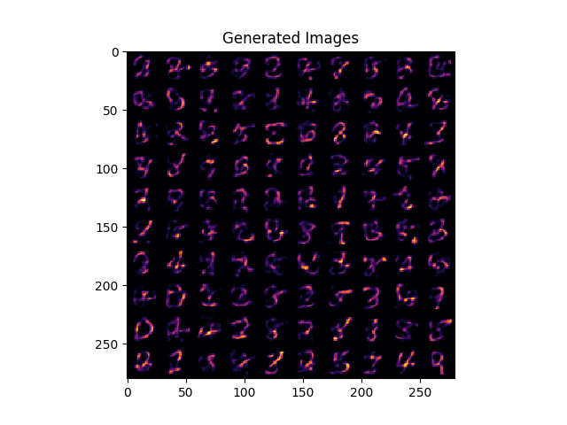

## JAX Discrete Samplers

<p align="center"></img></p>

This repository implements discrete sampling strategies on a Categorical VAE in JAX. Following samplers are implemented-

- [x] Identity (Deterministic Autoencoder)
- [x] Gumbel Max
- [x] Gumbel Softmax
- [x] Straight-Through
- [x] Straight-Through Gumbel Softmax
- [x] Gumbel-Rao Monte Carlo (to be cross-checked)

## Instructions

Install JAX using the following-

```
pip install "jax[cuda111]<=0.21.1" -f https://storage.googleapis.com/jax-releases/jax_releases.html
```

In case of memory errors use the following flag-

```
XLA_PYTHON_CLIENT_MEM_FRACTION=0.80 python ...
XLA_FLAGS=--xla_gpu_force_compilation_parallelism=1 python ...
```

Train a categorical VAE with `straight_through_gumbel_softmax` using the following-

```
python train.py --sampler straight_through_gumbel_softmax
```

Samples will be saved in as a `results.png` file.

## Citation

If you find the code helpful then please cite the following-

```
@misc{karush17discsamplers,
  author = {Karush Suri},
  title = {JAX Discrete Samplers},
  year = {2022},
  howpublished = {\url{https://github.com/karush17/jax-discrete-samplers}},
  note = {commit xxxxxxx}
}
```
